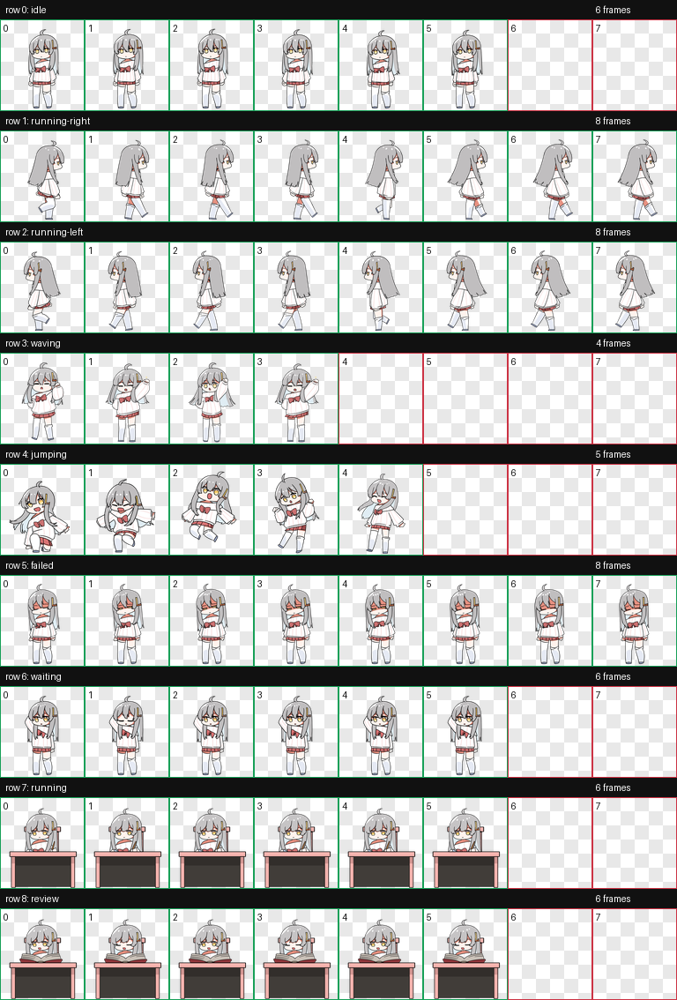

# Loris Codex Pet / 萝莉斯 Codex 桌宠

> Free, non-commercial distribution only. / 仅限免费、非商业分发。

An unofficial Codex Pet adaptation of **Loris from VPet Simulator**.

这是将《虚拟桌宠模拟器》（VPet Simulator）中的**萝莉斯**适配为 Codex Pet 的非官方项目。



This repository does not claim ownership of Loris, the character design, or the original animation artwork. The animation-derived files remain subject to the upstream VPet authorization terms. Read [Third-Party Notices](THIRD_PARTY_NOTICES.md) before using or redistributing them.

本仓库不主张拥有萝莉斯、角色设计或原始动画美术的版权。由动画衍生的文件仍受 VPet 上游授权条款约束；使用或再分发前请阅读[第三方声明](THIRD_PARTY_NOTICES.md)。

## English

### What this is

The package selects, resizes, aligns, and rearranges existing default Loris animation frames into the Codex Pet sprite-atlas format. It is a free, non-commercial community adaptation and is not affiliated with or endorsed by OpenAI, LB Game, VPet Simulator, or the VUP-Simulator team.

The original VPet archive, `.lps` file, and extracted source frames are intentionally not included.

### Current release: v3.0.0

v3 provides all nine standard Codex states, including task-oriented `waiting`, desk-work `running`, and book-reading `review` animations. Directional movement, waving, jumping, and failure animations are also included.

Known limitation: Codex can fall back to the slower `idle` loop while a task is still active. In v3, that loop looks like standing/resting. The later v4 release addresses this visual mismatch.

### Install on Windows

1. Open this repository's **Releases** page.
2. Download `loris-vpet-v3.zip`.
3. Extract the ZIP.
4. Copy the extracted `loris-vpet` folder to:

   ```text
   %USERPROFILE%\.codex\pets\loris-vpet
   ```

5. Confirm that these files are directly inside the folder:

   ```text
   %USERPROFILE%\.codex\pets\loris-vpet\pet.json
   %USERPROFILE%\.codex\pets\loris-vpet\spritesheet.webp
   ```

6. Restart Codex, or open **Settings > Pets**, refresh, and select **Loris**.

Always replace `pet.json` and `spritesheet.webp` together when updating. Do not mix files from different releases.

### Upload on the web

Download the standalone `loris-vpet-v3-spritesheet.webp` release asset, then use **Settings > Personalization > Pet > Upload pet**. The file is a transparent `1536 × 1872` WebP under 20 MiB, matching the current web upload requirements in the [official Pets documentation](https://learn.chatgpt.com/docs/pets).

### Remove

Close Codex, remove `%USERPROFILE%\.codex\pets\loris-vpet`, and reopen Codex.

### Compatibility and QA

- Codex sprite schema: v1 (`spriteVersionNumber: 1`)
- Atlas: `1536 × 1872`
- Cell: `192 × 208`
- Grid: 8 columns × 9 rows
- Format: transparent WebP
- Deterministic validation: passed with no errors or warnings

The repository release number (`v3`, later `v4`) is the adaptation version and is separate from Codex's sprite schema version.

### Rights and redistribution

This release is free and non-commercial. If you redistribute any animation-derived file, you must carry the complete notices in [THIRD_PARTY_NOTICES.md](THIRD_PARTY_NOTICES.md), link to the [official VPet repository](https://github.com/LorisYounger/VPet), disclose the upstream non-commercial, commercial, and distribution conditions, and charge no fee or profit from the files.

## 中文

### 项目说明

本项目把萝莉斯的默认动画帧重新选帧、缩放、对齐并整理为 Codex Pet 图集。它是免费、非商业的社区适配项目，与 OpenAI、LB Game、《虚拟桌宠模拟器》或虚拟主播模拟器制作组不存在隶属、合作或背书关系。

仓库有意不包含原始 VPet 压缩包、`.lps` 文件或解包后的源动画帧。

### 当前版本：v3.0.0

v3 提供 Codex 的九种标准状态，包括面向任务的 `waiting`、桌前工作的 `running` 和读书审阅的 `review`，并保留左右移动、挥手、跳跃和失败动作。

已知限制：任务仍在进行时，Codex 可能回退到较慢的 `idle` 循环。v3 的这个循环看起来像站立或休息；之后发布的 v4 会处理这种视觉错位。

### Windows 安装步骤

1. 打开本仓库的 **Releases** 页面。
2. 下载 `loris-vpet-v3.zip`。
3. 解压 ZIP。
4. 把解压得到的 `loris-vpet` 文件夹复制到：

   ```text
   %USERPROFILE%\.codex\pets\loris-vpet
   ```

5. 确认以下文件直接位于该文件夹内：

   ```text
   %USERPROFILE%\.codex\pets\loris-vpet\pet.json
   %USERPROFILE%\.codex\pets\loris-vpet\spritesheet.webp
   ```

6. 重启 Codex；或者打开 **设置 > Pets**，刷新后选择 **Loris**。

更新时必须同时替换 `pet.json` 和 `spritesheet.webp`，不要混用不同版本的文件。

### 网页端上传

下载 Release 中独立提供的 `loris-vpet-v3-spritesheet.webp`，然后在 **设置 > 个性化 > Pet > 上传宠物** 中上传。该文件是带透明通道的 `1536 × 1872` WebP，且小于 20 MiB，符合[官方 Pets 文档](https://learn.chatgpt.com/docs/pets)列出的网页上传要求。

### 删除

关闭 Codex，删除 `%USERPROFILE%\.codex\pets\loris-vpet` 文件夹，然后重新打开 Codex。

### 兼容与验证

- Codex 图集规范：v1（`spriteVersionNumber: 1`）
- 图集尺寸：`1536 × 1872`
- 单格尺寸：`192 × 208`
- 网格：8 列 × 9 行
- 格式：带透明通道的 WebP
- 确定性验证：通过，无错误、无警告

仓库发布版本（v3、之后的 v4）是适配版本，与 Codex 图集规范版本并不是同一个概念。

### 权利与再分发

本 Release 免费且仅限非商业用途。再分发任何由动画衍生的文件时，必须一并保留 [THIRD_PARTY_NOTICES.md](THIRD_PARTY_NOTICES.md) 中的完整声明，链接到 [VPet 官方仓库](https://github.com/LorisYounger/VPet)，披露上游的非商业、商业和分发条件，并且不得就这些文件收费或获利。

